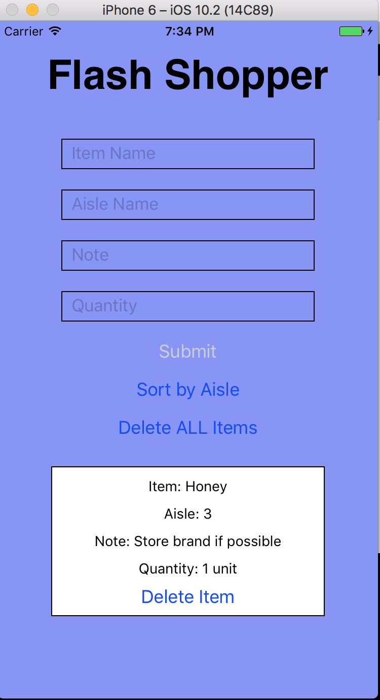

Flash Shopper in React Native

This is a grocery list app built in React Native. It allows the user to add, delete, and sort grocery items. It stems from my prior grocery list projects, the most recent of which is [the Redux version](https://github.com/gness1804/grocery-list-redux).

This app works for both iOS and Android.
